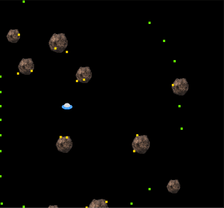

# Kuiper Escape Using Reinforcement Learning

## Aim
 To simulate and analyze an agent's navigation in the custom Kuiper belt environment and hence train it to maximize rewards by avoiding obstacles and exploring efficiently using reinforcement learning algorithms.

## Requirements
1. Numpy
2. Matplotlib
3. Gymnasium
   - gym_kuiper_escape (custom lib)

## Kuiper Belt Environment
To challenge the agent's learning capabilities, the custom Kuiper Belt environment was designed as a complex and dynamic scenario. Unlike simpler environments, this setup provided limited knowledge of its dynamics, requiring the agent to learn optimal strategies through exploration and adaptation. This made it an ideal choice for implementing and analyzing reinforcement learning algorithms in a more realistic and unpredictable setting.

### State Space
The state is a "virtual" lidar system. It sends off virtual beams of light in all directions to gather an array of points describing the distance and characteristics of nearby objects. The size of the lidar array and resulting observation/state space is configurable when the environment is initialized.

The observation data (for each beam in the lidar array):
- Distance (i.e. radial distance from player to terminating point of lidar beam) Collision detection
- 0 if terminated at edge of screen, or at max radius distance 1 if collided with a rock

e.g [ 0 0.1 0.2 0.3 0.5 0.6 0.2 0.3 | 0 1 0 0 0 1 0 1 ] where the first 8 in the array indicate normalised distances of the rock from the agent and the last 8 in the array indicate whether the rock will collide or not.

### Action Space
The agent has the following discrete set of actions :
- 0: Don't move
- 1: Up
- 2: Right
- 3: Down
- 4: Left

### Reward Function
Reward is given to the agent according to a function which is inversely related to the distance from the center of the environment screen to the agent . Further, a negative reward is awarded to the agent if collision is detected .

### Learning Process
Initially Agent takes random actions and mostly traverse along the edges navigating and exploring the environment

.gif)

After a certain number of episodes, the agent begins to improve its navigation skills within the environment, demonstrating a more strategic approach by effectively avoiding rocks.

After 12k episodes, the agent has now learned enough, navigating through the environment, skillfully avoiding the rocks with precision. Its movements have become more efficient, showing a clear understanding of the surroundings and an ability to adapt to challenges.

### Algorithms
Reinforcement learning offers a variety of algorithms that are useful for solving problems in model-free environments, where the agent does not have prior knowledge of the environment's dynamics. For this project, Q-learning was chosen as the primary algorithm because of its faster optimization rate (or convergence) compared to many other methods. Q-learning is an off-policy algorithm, meaning it learns the optimal policy by considering actions that may not necessarily follow the current policy. This property makes it highly effective for balancing exploration and exploitation. Since Q-learning focuses heavily on exploring the environment to gather more information, it aligns perfectly with the needs of this project, where the agent must adapt and improve its navigation strategies in a dynamic and unknown setting.

The link for the code has been provided below .

[Kuiper Escape](Code/tes.py)

### Convergence problem with continuous observation space: 
When we consider continuous observation space (For eg:  2.21 and 2.2134 are different distances in observation space) it results in memory overflow and consequently we get an insufficient Q table for convergence. Thus to reduce our computational load , we discretized this continuous observation space which provided us with only few values for our policy convergence and hence made it more efficient and faster.

### Results

